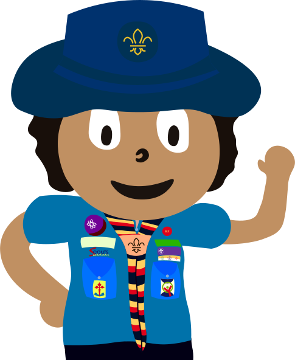

  

  
  
  
  

---

# 👋 Hi, I'm Ivan Linares

### 🌱🌍 Creating a Better World | Scouting, Creativity & Tech

I'm a passionate **Scout** who loves technology, music, and photography. I specialize in **fullstack development** focused on web development, and I enjoy creating content for social media. My goal is to combine my technical skills with my passion for leadership and youth animation to build a better world.

---

## 🚀 About Me

- 🎨 **UI/UX:** Design and user experience for web and mobile development.
- 🌐 **Web Design:** Building websites and web apps with modern technologies.
- 🧑‍🤝‍🧑 **Leadership:** Participant and organizer of youth development events.
- 🌲 **Nature Lover:** Inspired by the outdoors and creativity in every project.

---

## 🛠️ Technologies & Tools

  
  
  
  
  
  
  
  
  
  
  
  
  
  
  
  
  

---

## 📖 Blog

Visit my [blog](https://ivnlinares.github.io/IvnLinares/) to read about my experiences and learnings in web development, UI/UX design, and more.

---

## 📫 Contact

  
  
  
  
  

---

### 🌟 "Building a better world through technology, creativity, and nature."
